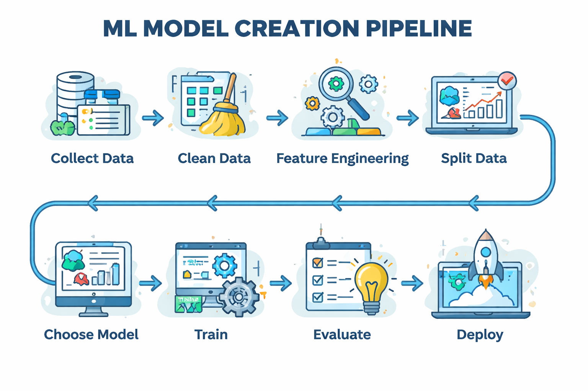

# Basics of Machine Learning

## 1. What ML Really Is

**Machine Learning** = data → algorithm → trained model → predictions

## 2. Types of ML

### 2.1 [Supervised Learning (Most Common)](https://github.com/VoidKernel/Basics-of-ML/blob/main/SupervisedLearning.md)

**Examples:**
- image → cat/dog
- email → spam/not spam
- house features → price

**Algorithms:**
- [Linear Regression](https://github.com/VoidKernel/Basics-of-ML/blob/main/SupervisedLearning.md#1-linear-regression)
- [Logistic Regression](https://github.com/VoidKernel/Basics-of-ML/blob/main/SupervisedLearning.md#2-logistic-regression)
- Decision Tree
- Random Forest
- SVM
- Neural Networks

> **Use this 90% of the time.**

### 2.2 [Unsupervised Learning](https://github.com/VoidKernel/Basics-of-ML/blob/main/UnsupervisedLearning.md)

**Examples:**
- customer segmentation
- anomaly detection

**Algorithms:**
- [K-Means](https://github.com/VoidKernel/Basics-of-ML/blob/main/K-Mean.md)
- DBSCAN
- PCA

### 2.3 [Reinforcement Learning](https://github.com/VoidKernel/Basics-of-ML/blob/main/ReinforcementLearning.md)

Agent + environment + rewards.

**Used in:**
- robotics
- games
- control systems

## 3. ML Model Creation Pipeline (Real Workflow)

1. Collect data
2. Clean data
3. Feature engineering
4. Split data
5. [Choose model](https://github.com/VoidKernel/Basics-of-ML/blob/main/Choose_Model.md)
6. [Train](https://github.com/VoidKernel/Basics-of-ML/blob/main/Train.md)
7. Evaluate
8. Improve
9. Deploy

> **Miss one → garbage model.**




## [4. Data Basics (The Part Everyone Underestimates)](https://github.com/VoidKernel/Basics-of-ML/blob/main/DataSplit.md)


### Data Splitting
- **70%** training
- **15%** validation
- **15%** testing
## 5. Model Evaluation (Don't Trust Your Model Blindly)

### Regression Metrics
- **MAE** (Mean Absolute Error)
- **MSE** (Mean Squared Error)
- **RMSE** (Root Mean Squared Error)
- **R²** (R-squared)

### Classification Metrics
- **Accuracy**
- **Precision**
- **Recall**
- **F1-score**
- **Confusion Matrix**

**Example:**

```python
from sklearn.metrics import accuracy_score

accuracy = accuracy_score(y_test, y_pred)
print(accuracy)
```

---

## 6. Overfitting vs Underfitting (The Eternal Pain)

- **Overfitting:** memorizes training data, fails in real world
- **Underfitting:** too dumb to learn patterns

**Fix with:**
- more data
- simpler model
- regularization
- cross-validation

---

## [7. What You Should Learn Next (Serious Path)](https://github.com/VoidKernel/Basics-of-ML/blob/main/Phase1%E2%80%93Foundations.md)

### Phase 1 – Foundations
- Python (numpy, pandas)
- statistics basics
- scikit-learn
- data preprocessing

### Phase 2 – Models
- Decision Trees
- Random Forest
- XGBoost
- SVM

### Phase 3 – Deep Learning
- Neural Networks
- PyTorch or TensorFlow
- CNN (images)
- RNN/Transformers (text)

### Phase 4 – Real World
- model saving (pickle/joblib)
- REST APIs (FastAPI)
- Docker
- monitoring

---

## 8. Practical Learning Plan (2 Weeks)

### Day 1–3
- numpy, pandas
- data cleaning
- plotting

### Day 4–6
- linear & logistic regression
- metrics

### Day 7–10
- decision trees
- random forest
- feature engineering

### Day 11–14
**Build 1 project:**
- spam classifier
- house price predictor
- sentiment analysis

---

## 9. Brutally Honest Advice

- ML is **80%** data cleaning
- **15%** debugging
- **5%** actual "modeling"

5% actual “modeling”


