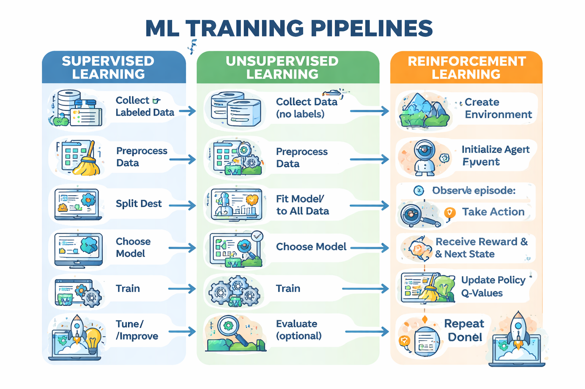

# ML Training Methods

## 1. Supervised Learning

**Goal:** Learn mapping from input → known output.

### Workflow

1. Collect labeled data (X = features, y = labels)
2. Preprocess data (clean, scale, encode)
3. Split data (train/test or train/val/test)
4. Choose a model (Linear Regression, Logistic, Random Forest…)
5. Train model on training set (model.fit)
6. Evaluate model on validation/test set (metrics: accuracy, MSE, etc.)
7. Tune hyperparameters if needed
8. Deploy model

### Key Points

- You have answers (labels) to compare against
- Loss function = measures error between predicted vs real
- Training = minimizing that error

### Example (Scikit-learn, Classification)

```python
from sklearn.ensemble import RandomForestClassifier
from sklearn.model_selection import train_test_split
from sklearn.metrics import accuracy_score

X_train, X_test, y_train, y_test = train_test_split(X, y, test_size=0.2, random_state=42)

model = RandomForestClassifier()
model.fit(X_train, y_train)

y_pred = model.predict(X_test)
print("Accuracy:", accuracy_score(y_test, y_pred))
```

---

## 2. Unsupervised Learning

**Goal:** Find patterns in data without labels.

### Workflow

1. Collect data (X only, no y)
2. Preprocess data (clean, scale)
3. Choose a model (K-Means, DBSCAN, PCA)
4. Train model on all data (model.fit)
5. Evaluate model (optional, metrics like silhouette score)
6. Use model for clustering, dimensionality reduction, anomaly detection

### Key Points

- No labels → model finds structure itself
- Training = grouping similar points / reducing dimensions / detecting anomalies

### Example (K-Means Clustering)

```python
from sklearn.cluster import KMeans
from sklearn.preprocessing import StandardScaler

X_scaled = StandardScaler().fit_transform(X)

kmeans = KMeans(n_clusters=3, random_state=42)
kmeans.fit(X_scaled)

print("Cluster labels:", kmeans.labels_)
```

> No y to check against; evaluation often uses metrics like silhouette score.

---

## 3. Reinforcement Learning

**Goal:** Learn what actions to take to maximize cumulative reward from interacting with an environment.

### Workflow

1. Create environment (OpenAI Gym, custom environment)
2. Initialize agent (policy, Q-table, or neural network)
3. For many episodes:
   - a. Observe current state
   - b. Agent selects action (policy / ε-greedy)
   - c. Environment returns reward + next state
   - d. Agent updates policy/Q-values to improve future rewards
4. Repeat until agent learns optimal behavior
5. Evaluate performance (average reward per episode)
6. Deploy agent

### Key Points

- No fixed dataset → agent generates its own experiences
- Training = trial and error + learning from reward
- Feedback = reward signal, not correct labels
- Often uses exploration vs exploitation strategies

### Example (Simplified Q-learning for a Grid World)

```python
# Pseudo-code
for episode in range(1000):
    state = env.reset()
    done = False
    while not done:
        action = choose_action(state)        # e.g., ε-greedy
        next_state, reward, done = env.step(action)
        Q[state, action] = update_Q(Q, state, action, reward, next_state)
        state = next_state
```

---

## Summary Table

| Type          | Labels?                | Training Signal  | Training Method                     | Example Models                              |
|---------------|------------------------|------------------|-------------------------------------|---------------------------------------------|
| Supervised    | Yes                    | Loss/error       | Fit model to minimize loss          | Linear, Logistic, Random Forest, Neural Net |
| Unsupervised  | No                     | Patterns in data | Fit model to find structure         | K-Means, PCA, DBSCAN                        |
| Reinforcement | No labels, reward only | Reward signal    | Trial & error, policy/value updates | Q-Learning, DQN, PPO                        |

### In Short

- **Supervised** → learn from truth
- **Unsupervised** → discover hidden patterns
- **Reinforcement** → learn by trying and failing

---

## ML Training Pipelines – Side by Side

| Supervised                          | Unsupervised                    | Reinforcement Learning                     |
|-------------------------------------|--------------------------------|--------------------------------------------|
| 1. Collect labeled data             | 1. Collect data (no labels)    | 1. Create environment                      |
| 2. Preprocess data (clean, scale, encode) | 2. Preprocess data        | 2. Initialize agent (policy/Q-table)       |
| 3. Split data (train/test/validation) | 3. Fit model to all data     | 3. For each episode:                       |
| 4. Choose model (Linear, RandomForest…) | 4. Choose model (K-Means, PCA) | - Observe state                          |
| 5. Train: model.fit(X_train, y_train) | 5. Train: model.fit(X)       | - Take action                              |
| 6. Evaluate (metrics: accuracy, MSE) | 6. Evaluate (optional)        | - Receive reward & next state              |
| 7. Tune / Improve                   | 7. Tune/Improve                | - Update policy / Q-values                 |
| 8. Deploy                           | 8. Deploy                      | - Repeat until done                        |
|                                     |                                | 4. Evaluate performance (average reward)   |
|                                     |                                | 5. Repeat episodes until agent learns      |
|                                     |                                | 6. Deploy agent                            |

---


